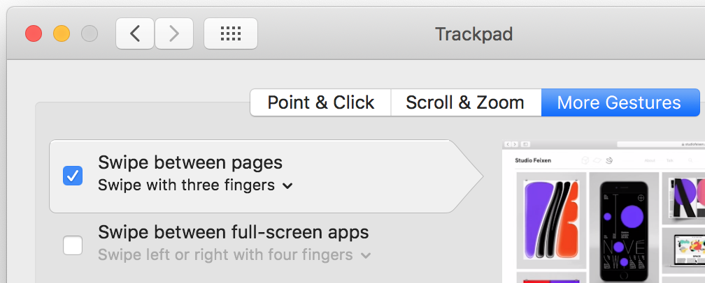

# Swipe To Navigate VSCode Extension

## Features

### Adding support for navigating: 
- Currently opened tabs.
- Currently opened tabs within a group.
- Recently focused code and opened files.
- Recently opened files.


## Supported Platforms

* ### `macOS`

    * Navigate using three finger swipes on the touchpad in a similar fashion to Xcode.
    * 


* ### `Windows` & `Linux`
    * Navigate using keyboard media keys or browser commands, as well as the "Back" button built into some mice on Windows.
    
## Supported configuration options

```jsonc
"swipeToNavigate.action": "disabled" | "tabs" |  "grouped-tabs" | "recent-code" | "recent-files"
```

### Examples:

* Currently opened *tabs* - **default**.
```jsonc
"swipeToNavigate.action": "tabs"
```

* Currently opened *tabs* in a single *group*.
```jsonc
"swipeToNavigate.action": "grouped-tabs"
```

* Recently focused *code* & *files*  - **like Xcode**.
```jsonc
"swipeToNavigate.action": "recent-code"
```

* Recently opened *files*.
```jsonc
"swipeToNavigate.action": "recent-files"
```


## How does it work?

Swipe To Navigate  relies on the [Monkey Patch Extension](https://marketplace.visualstudio.com/items?itemName=iocave.monkey-patch) to inject custom javascript in VSCode. After installation you should
be prompted to enable Monkey Patch. You can always trigger this manually by invoking the "Enable Monkey Patch" command.

## Why Monkey Patch? 
These changes were initially [proposed](https://github.com/microsoft/vscode/pull/82528) directly to `VSCode` but [this discussion](https://github.com/microsoft/vscode/issues/82588) indicated that they're trying to limit further code that depends on `Electron` APIs

## Credits

[Monkey Patch Extension](https://marketplace.visualstudio.com/items?itemName=iocave.monkey-patch) from [Matej Knopp](https://github.com/knopp) made this possible without direct [changes](https://github.com/microsoft/vscode/pull/82528) to `VSCode`. 

